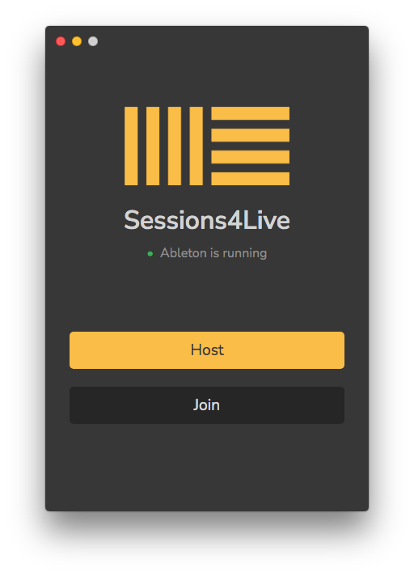
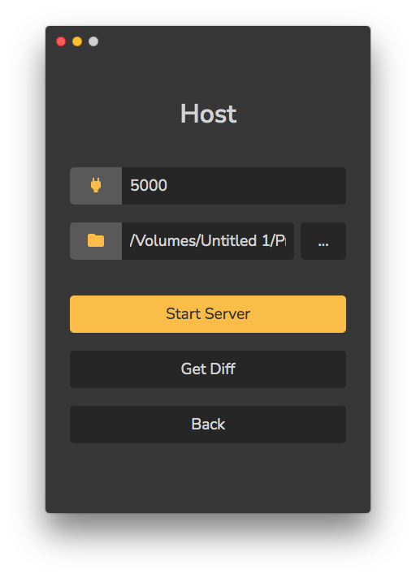

    

<h1 align="center">Sessions4Live</h1>

## What is Sessions4Live?

Sessions4Live (or S4L) is a tool for collaborating on Ableton Live projects in real time, much like Google Docs or VSCode LiveShare. It brings real-time collaboration to the studio.

## How does it work?

**Short answer**: Magic.

**Long answer**: Behind the scenes, S4L tracks the block of RAM Ableton writes to and monitors unsaved changes to the project. It also uses Git to track file changes in the project directory. This is then synced across the network to all the connected clients and mirrored on their end.

## Can I use it?

Short answer, no. It's still in development with a test build on its way. You're free to watch the repo for any status updates and changes.